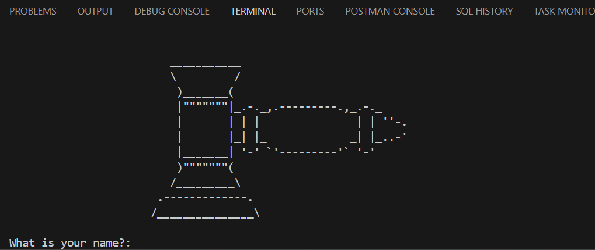

# Secret Auction CLI

## Overview

A simple command-line “secret auction” app. Multiple bidders can enter their names and bids privately; when bidding ends, the program determines and prints the highest bidder and winning amount.

## Demo



## How It Works

The program loops, collecting name/bid pairs into a dictionary. After each entry it clears the screen using os.system("cls") on Windows or os.system("clear") on macOS/Linux, so the next bidder can’t see previous inputs. When the user indicates there are no more bidders, the `find_highest_bider` function scans the dictionary to find the maximum bid and announces the winner.

Key steps:

* Prompt for bidder name and bid amount.
* Store bids in a dictionary (`{name: amount}`).
* Ask if there are more bidders; continue or stop accordingly.
* On stop, compute the highest bid and print the winner.

> Note: The file includes an ASCII `logo` string and also an `from art import logo` line. If you **don’t** have a local `art.py` providing `logo`, either remove the import or keep only one `logo` definition.

## How to Run

**Requirements**

* Python 3.8+ 

**Steps**

1. Save the script as `secret_auction.py`.

   ```bash
   python -m venv .venv
   # Windows
   .venv\Scripts\activate
   # macOS/Linux
   source .venv/bin/activate
   ```
2. If you have a local `art.py` that defines `logo`, keep the import line. Otherwise, delete the `from art import logo` line and retain the ASCII `logo` variable in the file.
3. Run the program:

   ```bash
   python secret_auction.py
   ```
4. Follow the prompts to add bidders. Type `no` when there are no more bidders.

## Resources

* ASCII Art reference (optional for your banner): [https://ascii.co.uk/art](https://ascii.co.uk/art)
